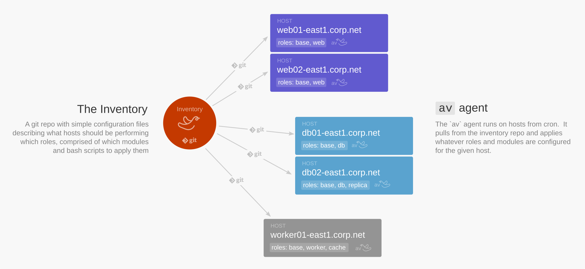

***
###

Minimal distributed configuration management in bash.  Tiny alternative to ansible / chef / puppet / etc.  Made with :heart: by the friendly folks at https://frameableinc.com

```
$ sudo av apply
Fetching inventory...
Applying module nginx
Applying module memcached
Done
```

## How it works



Aviary.sh follows some guiding principles:

- bash is just fine (yes, it is)
- minimize levels of abstraction
- each host takes care of itself

Each host periodically fetches the latest version of the inventory to see what roles should it be performing.  Given whatever roles, the inventory also describes modules (services, programs, etc) that need to be installed and running in order to fulfill the role, and the host configures itself accordingly.  The inventory is a git repo with a specific directory structure and idempotent scripts to apply modules.


## Getting started

#### Installation

Install from the command line, on a box to be managed by aviary.sh:

```bash
curl https://aviary.sh/install | sudo bash
```


#### Inventory setup

Configure your inventory if you don't have one yet:

```bash
mkdir inventory
cd inventory
mkdir {hosts,modules,roles,directives}
touch {hosts,modules,roles,directives}/.gitkeep
git init
git add .
git commit -m "initial commit"
```

Configure and push your repo to an origin:

```bash
git remote add origin $my_origin_url
git push -u origin master
```

Set your inventory url in config:

```bash
echo inventory_git_url=$my_origin_url >> /var/lib/aviary/config
```
Of course the dealings with git will be non-interactive, so you need to either set up ssh keys or access tokens in order to make that work.  In GitHub for example, find "Personal Access Tokens" under your account settings.  Once you have an access token, you can include it in the git url, e.g., `https://<username>:<access_token>@github.com/organization/aviary-inventory.git`


#### Modules

In the `inventory` directory we created above, add our first module:

```bash
mkdir modules/motd
```

Create an idempotent script to configure the message-of-the-day that users will see when they log in to this box.  In the inventory, create `modules/motd/apply` with these contents:

```bash
# inventory/modules/motd/apply
cat <<EOF > /etc/motd
"Ever make mistakes in life? Let’s make them birds. Yeah, they’re birds now."
--Bob Ross
EOF
```

Now create this host in the inventory, and add the motd module to be applied:

```bash
mkdir hosts/$(hostname)
echo motd > hosts/$(hostname)/modules
```

It's usually better practice to apply roles (sets of modules) to hosts, but you can also apply ad-hoc modules directly if you like, as we're doing here.

Now check in these contents and push them up to the inventory repo.

#### Running `av`

To apply our module, run `av apply`.

```bash
# av apply
Fetching inventory...
Applying motd...
Done.
```

Inspect `/etc/motd` to see that our motd module has in fact been applied.

Running `av status` (or just `av`) tells us how the host is configured and what is its status:

```bash
# av status
STATUS OK
```

#### Templates and variables

In order to make configuration files dynamic, we can use template files and variable interpolation.  Templates are {{ moustache }} style, and variables can be configured at various levels of the inventory directory hierarchy in `variables` bash files containing variable assignments.

Let's spruce up our `motd` module.  In the inventory, let's add a template in `modules/motd`:

```bash
# inventory/modules/motd/motd.template

Welcome to {{ hostname }}

"Ever make mistakes in life? Let’s make them birds. Yeah, they’re birds now."
--Bob Ross
```

Set the `hostname` variable in a `variables` file:

```bash
# inventory/modules/motd/variables

hostname=$(hostname)
```

Set the `apply` script to interpolate the template:

```bash
# inventory/modules/motd/apply

source template
source variables

template $(dirname $0)/motd.template > /etc/motd
```

Looking at our inventory directory structure, we should see something like this:

```
inventory
├── hosts
│   └── my-host-01
│       └── modules
├── modules
│   └── motd
│       ├── apply
│       ├── motd.template
│       └── variables
├── roles
└── directives
```

From here, add more modules, group modules into roles, and apply roles to your hosts, similarly to how we did with this first module.


## Concepts

**Inventory** - Git repository where you keep configuration about your servers and what-all they should be doing.  Consists of hosts, roles, and modules.

**Host** - Server virtual or not with a hostname.

**Role** - High-level function that you define (e.g., "application server", or "database server") to be assumed by the host.  Multiple roles may be applied to a host.

**Module** - Service or program (e.g., "node", or "postgres") required to fulfill a role.  A role will usually be comprised of many modules.

**Directive** - One-time set of commands to be executed immediately.

## Inventory

The inventory is the git repository where you keep configuration about your servers -- what roles they play, what services they run, etc.  

There are four top-level directories: `hosts`, `roles`, `modules`, and `directives`.  Files in each directory are newline-delimited text files, unless specified otherwise

### Hosts

The hosts directory contains a directory for each host.  In each host directory live the files:
  - `roles` - a list of roles to be fulfilled by the host
  - `modules` - a list of ad-hoc modules to be applied on the host
  - `variables` - list of bash variable assignments local to the host take priority over role variables

### Roles

The roles directory contains a directory for each role.  In each role directory live the files:
  - `modules` - a list of modules required to fulfill the given role
  - `variables` - list of bash variable assignments to be supplied when assuming a role

### Modules

The modules directory contains a directory for each module.  In each module directory live the files:
  - `apply` - idempotent bash script that will ensure the given service or program is installed and running
  - `variables` - list of bash variable assignments local to the module
  - `test` - bash script to assert that all looks well after we've run `apply`
  - any other files (templates, configuration files, etc) necessary to support the `apply` script

### Directives

The directives directory contains bash scripts to be executed once on each host, immediately when they are discovered.  Only directive scripts with modification times within the most recent 24 hours will be considered for execution.


## av

The command line tool is called `av`.  

```
av - manage configuration for your hosts

Usage:
  av [options] [command] [command-args]

Options:
  --help                   Show this help message
  --version                Show version
  --log-level <level>      Set the log level (trace,debug,info,warn,critical) [default: info]
  --force                  Run even if a pause or run lock is set
  --no-fetch               Don't fetch the inventory

Commands:
  status                   Report the status of the last run of `apply` [default]
  host <action>            Perform actions specific to the current host; more below
  apply                    Apply roles and their associated modules on this host 
  fetch                    Update local database by fetching from upstream
  directive                Run any outstanding directives from the inventory
  recover                  Reset run lock file after a failure
  pause                    Set the pause lock to avoid periodic runs while debugging
  resume                   Resume periodic runs after a pause

Host actions:
  host add                      Add the current host to the inventory
  host add-module <module>      Add the module to this host in the inventory
  host remove-module <module>   Remove the module from this host in the inventory
  host add-role <role>          Add the role to this host in the inventory
  host remove-role <role>       Remove the role from this host in the inventory
  host diff                     See what has changed in the local inventory
  host push                     Push local inventory changes up to the git origin
```

## Why Bash?

For just about three decades, bash has been standard issue on the vast majority of computers serving traffic on the Internet.  Other languages have come and gone, each with their own story and arc, while bash has just been there.

In addition to it consistently being there, it is good / good-enough at most everything we want to do while configuring a machine.  If we were using some other language half the time we'd end up shelling out anyway, so let's just stick in the shell to begin with and revel in the ease and consistency...

But it's too _funky_ you say.  Well, yes, bash can have its quirks.  But we need some funk every now and then.  Let's just embrace it!
